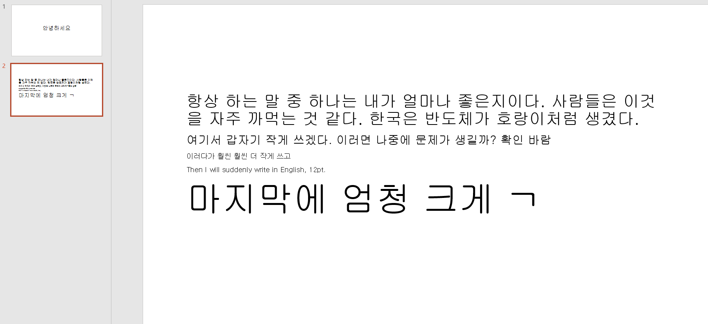
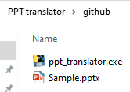
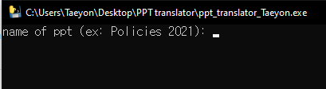
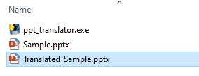

# PPT-translator
Uses (1) **googletrans** and (2) **python-pptx** libraries to translate pptx files of any language to English.  

#### Before  
{:class="img-responsive"}  
{:height="50%" width="50%"}  
{:height="700px" width="400px"}  
#### After  
  

#### output
This program will **output a separate pptx file** containing the translated **English** version.

#### How to use  
1. Place your ppt in the same directory as "ppt_translator.exe"  
  
2. Double click "ppt_translator.exe"
3. Enter name of your ppt. (Eg. type "Sample" for Sample.pptx)  
  
  
Make sure the ppt you want to translate is CLOSED. 
You will see an output file named "Translated_(original name).pptx"  (Eg. "Translated_Sample.pptx")
  
